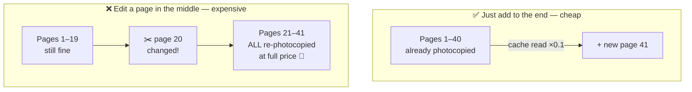
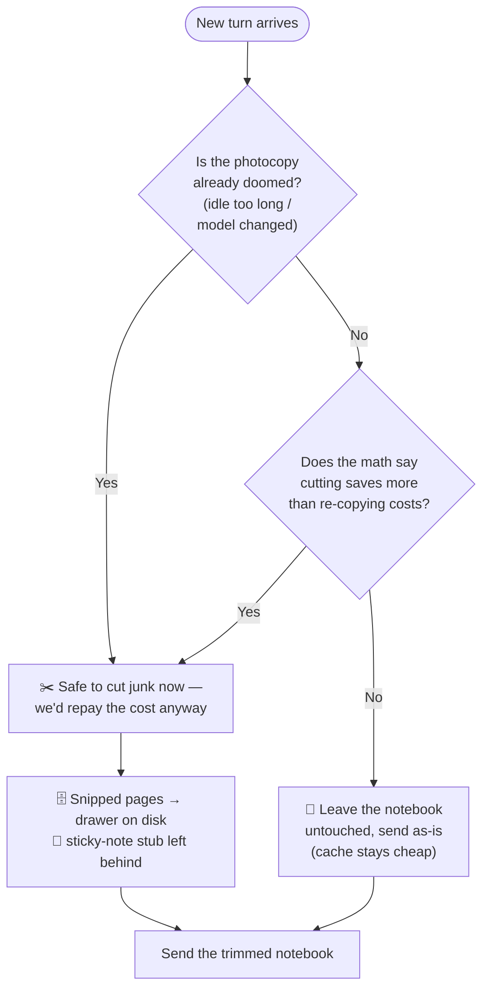
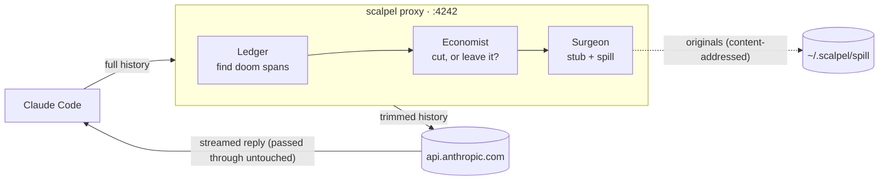

<div align="center">

# 🔪 scalpel

**Cache-aware context surgery for Claude Code.**

*Cut the dead weight out of your conversation history — without breaking the prompt cache — and pay for fewer tokens every turn.*

[](./LICENSE)
[](https://nodejs.org)
[](#development)
[](#known-limitations)

</div>

---

Every Claude API call ships your **entire conversation history**. Anthropic's prompt
cache makes re-sending an identical prefix nearly free — but only while the
conversation keeps growing in the same order. Tool results from ten turns ago that
have already been superseded, failed, or duplicated still sit in that prefix, costing
you tokens on *every* subsequent turn.

**scalpel** is a tiny local proxy that sits between Claude Code and the API. It spots
those dead spans, replaces them with compact stubs, and spills the originals to disk
for full recoverability — but only when the cache is already cold or the economics model
expects the cut to pay for itself. The result is a smaller, cheaper, more cache-stable
context: user instructions and assistant messages are left intact, while pruned tool
outputs become recoverable stubs.

```bash
npx ctx-scalpel start
export ANTHROPIC_BASE_URL=http://127.0.0.1:4242
# ...use Claude Code exactly as before.
```

---

## Table of contents

- [The big idea (explained like you're 12)](#the-big-idea-explained-like-youre-12)
- [Measured numbers](#measured-numbers)
- [How it works](#how-it-works)
- [Install](#install)
- [Tiers](#tiers)
- [Hooks companion](#hooks-companion)
- [Commands](#commands)
- [Escape hatch](#escape-hatch)
- [Configuration](#configuration)
- [What scalpel does *not* do](#what-scalpel-does-not-do)
- [Privacy & security](#privacy--security)
- [Development](#development)
- [Known limitations](#known-limitations)
- [License](#license)

---

## The big idea (explained like you're 12)

Imagine Claude Code is a **super-smart helper who has no memory at all**. Every single
time you ask it to do something, you have to hand it a notebook containing *everything*
that has happened so far — so it can remember what you're working on.

There's a catch: **the notebook gets thicker every turn.** Turn 1 is one page. By turn
50 you're handing over a 50-page notebook *every time you speak*. And you pay for every
page you hand over. 📈


### The magic photocopier (the cache)

Luckily there's a magic trick. Anthropic keeps a **photocopy of the pages it has
already seen**. If you hand over the same pages in the same order and just add a new
page at the end, it recognizes the old ones instantly and charges you only **one tenth**
the price for them. Cheap! That's a *cache read*.

But the photocopier is fussy. It only recognizes pages that are **exactly the same, in
exactly the same order, from the very first page.** The moment you change or remove a
page in the *middle* of the notebook, every page after it looks brand-new again — and
you pay **full price** to re-photocopy all of them. That's a *cache write*, and it's
expensive.



**This is exactly why other "context cleanup" tools made things *worse*.** They ripped
junk pages out of the middle of the notebook to make it shorter — but that broke the
photocopier, so every cleanup triggered a giant expensive re-copy. They saved pages and
lost money.

### What's actually junk in the notebook?

Lots of pages become useless as you work:

- 📄 You **read a file**, then changed it, then read it again → the old copy is dead weight.
- 💥 A command **failed** ("file not found"), you fixed it and moved on → nobody needs the error anymore.
- 👯 You read the **same file twice** without changing it → one copy is redundant.
- 🗑️ A huge directory listing from 30 turns ago that nothing refers to anymore.

### scalpel is a careful surgeon 🔪

scalpel reads the notebook and finds those dead pages — but it does **not** rip them out
recklessly. It only cuts at moments where the math works out in your favor:

1. **The photocopy was about to be thrown away anyway** — you took a long coffee break
   and the copy expired, or you switched models. Cutting now is free, because everything
   was going to be re-copied regardless.
2. **The savings beat the cost** — if a page is so big and you have so many turns left
   that keeping it cheap forever clearly outweighs one re-copy, scalpel does the surgery.
   Otherwise it leaves the notebook **completely untouched** and the photocopier stays happy.

And nothing is ever truly lost: every page scalpel snips is filed in a **drawer on your
disk**, and a little sticky-note is left in its place that says *"this was moved to the
drawer — go read it if you need it."*



That's the whole idea: **be a surgeon, not a shredder.** Cut only what's dead, only when
it's safe, and keep a recoverable copy of everything.

---

## Measured numbers

Benchmarked against a real local Claude Code corpus with `scalpel bench`:

```
sessions replayed:      131
baseline weighted cost: 1,558,195,456
scalpel  weighted cost: 1,258,101,772
estimated saving:       19.3%  (tier 2)
--- skip accounting ---
excluded (<5 requests): 208
skipped (oversized):    3
failed (errors):        0
parse errors (lines):   0
```

- **208** sessions were excluded for having fewer than 5 requests (too short to be
  meaningful); **3** were skipped as oversized (>20 MB or >6000 message lines). All 131
  replayed sessions had ≥5 requests, and 0 lines failed to parse.
- Weighted cost uses Anthropic's relative pricing: **cache-read ×0.1, cache-write ×2.0,
  input ×1, output ×5** (the ×2.0 write weight reflects the 1-hour cache TTL that
  subscription Claude Code uses).

Numbers are corpus-specific. Run `scalpel bench ~/.claude/projects` on **your own**
sessions to see what scalpel would have saved you. The defaults were tuned with a
one-factor-at-a-time sweep over a real corpus; the most impactful knob was lowering the
stale-result threshold (`staleMinTokens`) from 2000 to 1000 tokens.

> **Current limitation:** structural pruning measured **19.3%** weighted savings on this
> corpus. LLM summarization of old turns is not implemented in v0.1.0.

---

## How it works

scalpel is a transparent HTTP proxy. Every request flows through a pure pipeline —
**ledger → economist → surgeon** — and the surgery log is replayed byte-identically so a
warm cache prefix is never disturbed.



1. **Intercept** — scalpel listens on a local port and forwards to `api.anthropic.com`.
   Streaming (SSE) responses are passed straight through.
2. **Identify doom spans** — the ledger scores the conversation and marks spans that are
   safe to drop: superseded reads, duplicate results, failed commands, stale large
   results, dead snapshots.
3. **Decide** — the economist only commits surgery when the cache is already doomed
   (idle past the TTL, or model/system/tools changed) **or** when expected savings beat
   the re-write cost by a safety margin. Otherwise the history is sent untouched.
4. **Spill & stub** — pruned content is written to `~/.scalpel/spill/` keyed by content
   hash, and a compact stub replaces it:

   ```
   [scalpel: output pruned to save context (~1234 tokens). Original stored at
   ~/.scalpel/spill/ab12cd34.txt — Read it if needed. Reason: superseded-read.]
   ```
5. **Record** — every turn's token counts and savings estimate land in
   `~/.scalpel/savings.db` (SQLite). No message content is stored in the DB.

**Fail-open by design:** any error in the pruning pipeline forwards the original,
unmodified request. Worst case, scalpel does no pruning for that turn.

The design rests on three ideas: a **cache-stability invariant** (a warm prefix is never
rewritten), an **economics model** (cut only when expected cache-read savings beat the
re-write cost by a safety margin), and a **remaining-turns estimator** (longer sessions
justify more aggressive cuts). All three are enforced by the test suite.

---

## Install

**Requirements:** Node.js **≥ 20** (native `fetch`). The optional savings database
(`scalpel report`) uses `node:sqlite`, which is available in current Node 24 releases;
when `node:sqlite` is unavailable, the proxy runs normally and the savings DB simply
records nothing.

The package is published on npm as **`ctx-scalpel`** (the command is `scalpel`).

### Run it directly (no install)

```bash
npx ctx-scalpel start
export ANTHROPIC_BASE_URL=http://127.0.0.1:4242   # add to ~/.bashrc / ~/.zshrc
```

### Install globally

```bash
npm i -g ctx-scalpel            # installs the `scalpel` command
scalpel start
export ANTHROPIC_BASE_URL=http://127.0.0.1:4242
```

### Run it as a background service

```bash
scalpel install                       # writes a systemd user unit + prints the env snippet
systemctl --user enable --now scalpel
export ANTHROPIC_BASE_URL=http://127.0.0.1:4242
```

### From source

```bash
git clone https://github.com/MohammedBasioni/scalpel.git
cd scalpel
npm install
npm run build
node dist/cli.js start
```

---

## Tiers

| Tier | What gets pruned | When to use |
|------|------------------|-------------|
| **1** | Superseded reads, duplicate tool results, failed commands | Conservative — the safe default for anyone |
| **2** | Tier 1 **+** stale large results, dead snapshots | Aggressive — higher savings, same correctness guarantee (current default) |

```bash
scalpel tier 1     # or: scalpel tier 2   (restart to apply)
```

Both tiers carry the **identical** cache-safety and recoverability guarantees — Tier 2
simply considers more span kinds eligible.

---

## Hooks companion

The proxy prunes stale results from the rolling history. The optional **hooks companion**
attacks the problem at the *source* — it stops Claude Code from re-reading a file it
already has in context. (In the benchmark corpus, **27% of `Read` calls were exact
re-reads of unchanged files.**)

```bash
scalpel install-hooks      # prints a JSON snippet for ~/.claude/settings.json
```

The snippet wires two hooks:

- **PreToolUse (Read)** — denies a `Read` only if the file was *fully* read earlier this
  session **and** is byte-identical on disk. Anything uncertain is allowed.
- **PostToolUse (Read|Edit|Write)** — records each file's hash and size in a per-session
  ledger (`~/.scalpel/readledger/`) so future reads can be checked.

**Bypass:** reading with an explicit `offset`/`limit` is always allowed — only full
re-reads of unchanged files are blocked.

**Fail-open:** any error in a hook exits 0 with no output; Claude Code proceeds normally.

> ⚠️ Hooks compose. If you run other PreToolUse `Read` hooks (e.g. a leftover
> "wasted call" hook from another tool), you may see confusing double-denials. Check
> `~/.claude/settings.json` for overlapping entries before enabling scalpel's.

Hooks and proxy are complementary: hooks keep duplicate content from *entering* context;
the proxy prunes stale results that *do* accumulate.

---

## Commands

```
scalpel start              # start the proxy (default port 4242)
scalpel status             # is the proxy running?
scalpel report             # print savings statistics from ~/.scalpel/savings.db
scalpel tier <1|2>         # change the pruning tier
scalpel bench [dir]        # replay local sessions and estimate savings (default: ~/.claude/projects)
scalpel install            # write a systemd user unit file
scalpel install-hooks      # print the hooks snippet for ~/.claude/settings.json
```

---

## Escape hatch

Instantly bypass scalpel and talk straight to Anthropic:

```bash
unset ANTHROPIC_BASE_URL
```

No data is lost. Spilled content stays on disk and is re-paired on the next proxied turn.

---

## Configuration

Optional overrides live in `~/.scalpel/config.json` (all fields optional):

```jsonc
{
  "port": 4242,
  "tier": 2,
  "weights": { "read": 0.1, "write": 2.0, "output": 5 },
  "ledger": {
    "staleMinTokens": 1000   // min size for a "stale large result" to be eligible
  }
}
```

Defaults are tuned from a real corpus sweep. You usually don't need to touch this.

---

## What scalpel does *not* do

- ❌ **It does not summarize or rewrite anything Claude said.** It only removes
  tool-result *outputs* that are provably dead, and only by replacing them with a
  recoverable stub. Your reasoning, instructions, and code stay exactly as written.
- ❌ **It does not rewrite warm cache prefixes casually.** Warm-cache surgery happens
  only when the economist judges the expected savings worth the rewrite cost; otherwise,
  the request is forwarded unchanged.
- ❌ **It does not log or store your credentials.** Auth headers are forwarded
  verbatim to the upstream API (see below).

---

## Privacy & security

**Does scalpel handle my Anthropic credentials / OAuth tokens?**
Yes. As a local proxy, scalpel receives request headers and forwards them to the
upstream API. It never logs, stores, or inspects credential values such as
`Authorization` or `x-api-key`.

**What is stored on disk?**
- `~/.scalpel/spill/` — pruned tool-result content, keyed by SHA-256 of the original
  JSON. Only message content; no headers, no credentials.
- `~/.scalpel/savings.db` — SQLite ledger of per-turn token counts and savings
  estimates. No message content.
- `~/.scalpel/readledger/` — per-session file hashes/sizes for the hooks companion.
- `~/.scalpel/config.json` — your tier/port overrides (optional).

**How do I wipe everything?**
```bash
rm -rf ~/.scalpel
```
The next `scalpel start` recreates an empty database. No Claude sessions are affected —
scalpel's data is supplementary, never load-bearing.

**Will Claude get confused by the stubs?**
In practice, no — Claude reasons from current state, not from old tool-result text. If
you ever observe confusion, drop to `scalpel tier 1` or `unset ANTHROPIC_BASE_URL`. To
report a security issue, see [SECURITY.md](./SECURITY.md).

---

## Development

```bash
npm install
npm run build      # tsc
npm test           # vitest run  (53 tests)
```

Key invariants enforced by the suite:
- **`test/cache-invariant.test.ts`** is sacred — it asserts byte-exact prefix stability
  over 20 randomized 40-turn sessions: surgery never converts a warm cache read into an
  unplanned write. Never weaken it.
- Everything is **fail-open** — pruning and hooks must degrade to normal Claude Code
  behavior instead of blocking a session.

Zero runtime dependencies (Node built-ins only). See [CONTRIBUTING.md](./CONTRIBUTING.md).

---

## Known limitations

- scalpel performs structural pruning only. It does not summarize old turns or rewrite
  assistant messages.
- Savings depend on your sessions. The published benchmark measured **19.3%** weighted
  savings on one local Claude Code corpus; run `scalpel bench ~/.claude/projects` to
  estimate your own.
- `~/.scalpel/spill/` does not yet have an automatic retention policy. Remove
  `~/.scalpel` manually if you want to wipe scalpel's local data.

---

## License

[MIT](./LICENSE) © 2026 Mohammed Basioni
